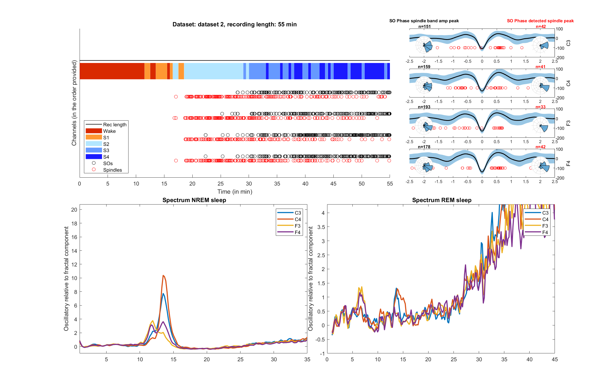

# Matlab
Matlab scripts commonly used in the Institute of Medical Psychology Tuebingen

## /event_detector/
Detect spindles and slow oscillations in fieldtrip data structures.  

`detectEvents` / `plotDetectedEvents`  
Example code to call these functions:   
```Matlab
  cfg	= [];
  cfg.scoring = scoring;
  cfg.scoring_epoch_length = 30; % length of one scoring epoch in s
  cfg.code_NREM = [2 3 4]; % code used in hyp for NREM stages
  cfg.code_REM = 5; % ...and for REM stages (can also be an array)
  cfg.code_WAKE	= 0;

  cfg.spi_dur_min = [0.6 0.3]; % in s
  cfg.spi_dur_max = [2.5 2.5]; % in s
  cfg.spi_thr(1,1) = 2; 
  cfg.spi_thr(2,1) = 2.25;
  cfg.spi_thr(3,1) = 2.5;
  cfg.spi_indiv	= 1;
  cfg.spi_indiv_chan = {'C3', 'C4'};

  cfg.slo_thr	= 2;
  cfg.slo_dur_min = 0.8;
  cfg.slo_dur_max = 2;
  cfg.slo_freq = [0.1 3.5];
  output = detectEvents(cfg, data);
  plotDetectedEvents(output) 
  ```

The output should look something like this:



## /helper_functions/
Little helper functions that can improve your life as a sleep researcher.

`hyp2trl`  
Turns a hypnogram into a trial structure as expected by FieldTrip.

`get_filenames`  
Returns a properly sorted list of files in a given folder (excluding subfolders, mac trash files etc.) or one filename starting with a matching string or the filename of the nth file in that folder.

`trial_selector`  
A little GUI to select trials (e.g. to mark them as artifactual). Shows 20 trial at once.


